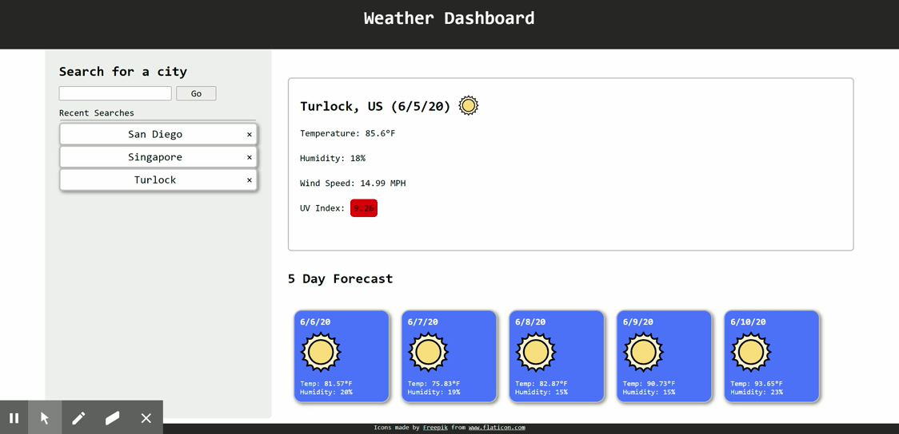

# Weather-Dashboard

> Created by: Andrew Knapp - [andrewjknapp](https://github.com/andrewjknapp)

## Link to Live Project

[Link to live project](https://andrewjknapp.github.io/Weather-Dashboard/)

## Summary

A sleek interface for keeping track of the weather.

## Languages and Tech Used

- HTML5
- CSS3
- Javascript
- JQuery
- OpenWeatherMap Api

## Documentation

OpenWeatherMap Api was used to gather data on the current weather, the UV index, and the weather forecast for each search. Once these responses were gathered the desired information was extracted and displayed through jquery dynamic updates. Each time the page is updated through a search the previous cities are stored into local storage and are called upon to populate the page on load. 

## Features

- Search city to retreive weather information
- Previously searched cities are stored in the side bar

## Live Demo

